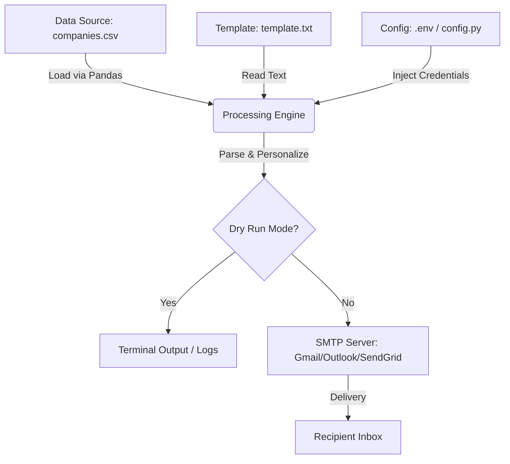

# PROJECT_MAP.md: Sponsorship Outreach Automation

As a Senior Software Engineer, I've designed this system to be modular, secure, and resilient. Here is the architectural blueprint for your email automation tool.

## 🏗 System Architecture

The data flows through a linear pipeline designed to minimize memory overhead and maximize reliability.

---

## 🔄 Logic Workflow (Read-Parse-Personalize-Send)

The execution follows a strict loop to ensure each record is handled independently:

1.  **Initialization**: Load environment variables (API keys, SMTP settings) and verify the existence of the CSV and Template files.
2.  **Data Loading**: The script reads `companies.csv` into a Pandas DataFrame.
3.  **Iteration**: For each row in the dataset:
    -   **Validation**: Check if the email address is present and follows a basic valid format.
    -   **Parsing**: Read the `template.txt` into a string.
    -   **Personalization**: Replace placeholders (e.g., `{{company_name}}`) with actual data from the current row.
    -   **Composition**: Build the MIME (Multipurpose Internet Mail Extensions) message, attaching headers (Subject, From, To).
4.  **Execution**:
    -   If **Dry Run** is active: Print the final email body and recipient to the console.
    -   If **Live Mode**: Establish a secure TLS connection with the SMTP server, authenticate, and send.
5.  **Logging**: Track successful sends and failures in a summary report.

---

## 🔐 Security Best Practices

### 1. Environment Variables (`.env`)
We never hardcode credentials. Hardcoding sensitive info (like your email password) is a major security risk, especially if the code is shared or pushed to GitHub.
-   **Method**: We use a `.env` file to store `SMTP_PASSWORD` and `SMTP_USER`.
-   **Implementation**: The `config.py` script uses `python-dotenv` to load these into the system's environment variables at runtime.

### 2. App-Specific Passwords
If using Gmail or Outlook, **do not use your regular login password**. Instead:
-   Enable Two-Factor Authentication (2FA).
-   Generate an **App Password** (a unique 16-character code). This keeps your primary password safe and allows you to revoke access specifically for this script at any time.

### 3. Secure Connections
The script uses `SMTP_SSL` or `starttls()` to ensure that the communication between your machine and the email server is encrypted, preventing "man-in-the-middle" attacks.

---

## 🛠 Required Dependencies
To run this, you will need:
- `pandas` (for data handling)
- `python-dotenv` (for security)
